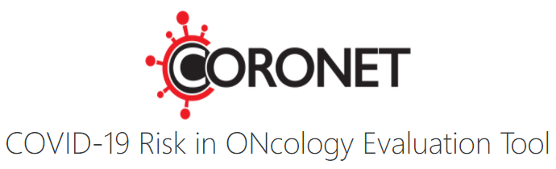

CORONET is an online tool to support decisions regarding hospital admissions or discharge in cancer patients presenting with symptoms of COVID-19 and the likely severity of illness. It is based on real world patient data and information as to how the tool was created can be found here (link to publication - pending).

The tool is available at:
https://coronet.manchester.ac.uk/

This repository contains the code to develop the CORONET model used in the recommendation generation tool.

Detailed description of the process of developing CORONET can be found in our publication:
https://www.medrxiv.org/content/10.1101/2020.11.30.20239095v1


```python

```
